# Cloud Identity Toolkit

A curated, public toolkit of PowerShell scripts and runbooks for managing Entra ID, Azure, and Microsoft 365 identity governance at scale — built from real-world automation work, redacted and generalized for public use.

**Who this is for:** IT professionals, security engineers, cloud architects, and anyone interested in practical identity and governance solutions across Microsoft cloud ecosystems.

## Architecture Overview

```mermaid
flowchart TD

subgraph group_foundation["Shared foundation"]
  node_common_manifest["Common module manifest<br/>PowerShell module"]
  node_common_module["Common output module<br/>PowerShell module"]
  node_logging["Shared logging<br/>PowerShell function<br/>[Add-Log.ps1]"]
end

subgraph group_entrypoints["Direct script entry points"]
  node_entra_auth["Entra authentication<br/>PowerShell script"]
  node_entra_governance["Entra governance reports<br/>PowerShell scripts"]
  node_entra_permission_action["Entra permission action<br/>PowerShell script"]
  node_azure_assessment["Azure assessments<br/>PowerShell scripts"]
  node_azure_write_action["Azure secret management<br/>PowerShell script"]
  node_m365_reporting["Microsoft 365 reporting<br/>PowerShell scripts"]
  node_teams_action["Teams lifecycle action<br/>PowerShell script"]
  node_intune_reporting["Intune compliance reports<br/>PowerShell scripts"]
  node_intune_notification["Intune notification action<br/>PowerShell script"]
end

subgraph group_cloud["Tenant control planes"]
  node_entra_graph{{"Entra ID &amp; Microsoft Graph<br/>identity API"}}
  node_azure_arm{{"Azure Resource Manager<br/>cloud control plane"}}
  node_m365_planes{{"Microsoft 365 control planes<br/>service APIs"}}
  node_intune_plane{{"Intune control plane<br/>device management API"}}
end

subgraph group_outcomes["Outcomes and maintenance"]
  node_reports["Reports, dashboards &amp; exports<br/>output"]
  node_admin_effects["Tenant mutations &amp; alerts<br/>operational outcome"]
  node_maintenance["Repository maintenance<br/>PowerShell scripts"]
end

node_operators(("Identity Operators &amp; Human & Workload Identities<br/>(Users, Apps, Managed Identities,<br/>Automation<br/>invokers"))

node_common_manifest -->|"declares"| node_common_module
node_common_module -->|"loads"| node_logging
node_operator -->|"invokes"| node_entra_auth
node_operator -->|"invokes directly"| node_entra_governance
node_operator -->|"invokes directly"| node_azure_assessment
node_operator -->|"invokes directly"| node_m365_reporting
node_operator -->|"invokes directly"| node_intune_reporting
node_entra_auth -->|"authenticates to"| node_entra_graph
node_entra_governance -->|"reads tenant state"| node_entra_graph
node_entra_permission_action -->|"grants permission"| node_entra_graph
node_azure_assessment -->|"reads resource state"| node_azure_arm
node_azure_write_action -->|"creates secret"| node_azure_arm
node_m365_reporting -->|"reads service state"| node_m365_planes
node_teams_action -->|"archives team"| node_m365_planes
node_intune_reporting -->|"reads compliance state"| node_intune_plane
node_intune_notification -->|"targets managed users/devices"| node_intune_plane
node_entra_governance -->|"produces"| node_reports
node_azure_assessment -->|"produces"| node_reports
node_m365_reporting -->|"produces"| node_reports
node_intune_reporting -->|"produces"| node_reports
node_entra_permission_action -->|"mutates access"| node_admin_effects
node_azure_write_action -->|"mutates tenant state"| node_admin_effects
node_teams_action -->|"mutates lifecycle"| node_admin_effects
node_intune_notification -->|"sends alert"| node_admin_effects

click node_common_manifest "https://github.com/lakshmananthangaraj/cloud-identity-toolkit/blob/main/Modules/CloudIdentityToolkit.Common/CloudIdentityToolkit.Common.psd1"
click node_common_module "https://github.com/lakshmananthangaraj/cloud-identity-toolkit/blob/main/Modules/CloudIdentityToolkit.Common/CloudIdentityToolkit.Common.psm1"
click node_logging "https://github.com/lakshmananthangaraj/cloud-identity-toolkit/blob/main/Modules/CloudIdentityToolkit.Common/Add-Log.ps1"
click node_entra_auth "https://github.com/lakshmananthangaraj/cloud-identity-toolkit/blob/main/Entra-ID/Authentication/Connect-EntraID.ps1"
click node_entra_governance "https://github.com/lakshmananthangaraj/cloud-identity-toolkit/blob/main/Entra-ID/PIM/Get-PrivilegedUsersReport.ps1"
click node_entra_permission_action "https://github.com/lakshmananthangaraj/cloud-identity-toolkit/blob/main/Entra-ID/AppRegistrations/Grant-SharePointSiteSelectedPermission.ps1"
click node_azure_assessment "https://github.com/lakshmananthangaraj/cloud-identity-toolkit/blob/main/Azure/Architecture/Generate-AzureCloudHealthDashboard.ps1"
click node_azure_write_action "https://github.com/lakshmananthangaraj/cloud-identity-toolkit/blob/main/Azure/KeyVault/New-AzureKeyVaultSecret.ps1"
click node_m365_reporting "https://github.com/lakshmananthangaraj/cloud-identity-toolkit/blob/main/Microsoft365/ExchangeOnline/Security/Get-MailboxAuditStatus.ps1"
click node_teams_action "https://github.com/lakshmananthangaraj/cloud-identity-toolkit/blob/main/Microsoft365/MicrosoftTeams/Lifecycle/Archive-MicrosoftTeam.ps1"
click node_intune_reporting "https://github.com/lakshmananthangaraj/cloud-identity-toolkit/blob/main/Intune/Get-DeviceComplianceReport.ps1"
click node_intune_notification "https://github.com/lakshmananthangaraj/cloud-identity-toolkit/blob/main/Intune/New-IntuneComplianceReminderNotification.ps1"
click node_maintenance "https://github.com/lakshmananthangaraj/cloud-identity-toolkit/blob/main/DeveloperTools/CodeQuality/Invoke-ScriptAnalyzer.ps1"

classDef toneNeutral fill:#f8fafc,stroke:#334155,stroke-width:1.5px,color:#0f172a
classDef toneBlue fill:#dbeafe,stroke:#2563eb,stroke-width:1.5px,color:#172554
classDef toneAmber fill:#fef3c7,stroke:#d97706,stroke-width:1.5px,color:#78350f
classDef toneMint fill:#dcfce7,stroke:#16a34a,stroke-width:1.5px,color:#14532d
classDef toneRose fill:#ffe4e6,stroke:#e11d48,stroke-width:1.5px,color:#881337
classDef toneIndigo fill:#e0e7ff,stroke:#4f46e5,stroke-width:1.5px,color:#312e81
classDef toneTeal fill:#ccfbf1,stroke:#0f766e,stroke-width:1.5px,color:#134e4a
class node_common_manifest,node_common_module,node_logging toneBlue
class node_entra_auth,node_entra_governance,node_entra_permission_action,node_azure_assessment,node_azure_write_action,node_m365_reporting,node_teams_action,node_intune_reporting,node_intune_notification toneAmber
class node_entra_graph,node_azure_arm,node_m365_planes,node_intune_plane toneMint
class node_reports,node_admin_effects,node_maintenance toneRose
class node_operator toneNeutral
```



## What's Included

| Area | What it covers |
|---|---|
| [`Entra-ID/`](./Entra-ID) | User, group, device, admin role (PIM), Conditional Access, MFA, application registration, and application proxy management |
| [`Azure/`](./Azure) | RBAC analysis/consolidation and Key Vault secret management |
| [`Microsoft365/`](./Microsoft365) | License inventory, reporting, and threshold alerting |
| [`DeveloperTools/`](./DeveloperTools) | Static analysis, auto-documentation, and module packaging for this toolkit's own scripts |
| [`Modules/CloudIdentityToolkit.Common`](./Modules/CloudIdentityToolkit.Common) | Shared logging/output helpers used across all scripts |

## Roadmap

This is a long-term, continuously growing project. Planned additions include:

- **AWS IAM** — identity governance and access analysis
- **Microsoft Defender** — security posture and alert automation

Follow the repo or ⭐ star it to track progress as these areas are added.

## Quick start

```powershell
git clone https://github.com/lakshmananthangaraj/cloud-identity-toolkit.git
cd cloud-identity-toolkit
```

Each script includes built-in help documentation and practical examples.

## Security

* No credentials, secrets, or production data are included.
* All examples use placeholder tenants, domains, and identifiers.
* Required permissions are documented for every solution.
* Please review scripts carefully before using them in production environments.

## Contributing

Contributions, suggestions, and discussions are welcome. This repository is maintained as a continuous learning and knowledge-sharing initiative.

## License

MIT - see [LICENSE](./LICENSE).
